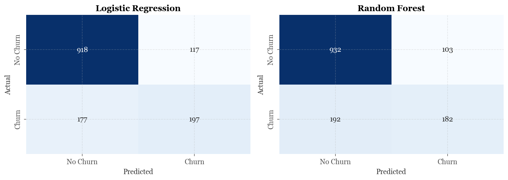
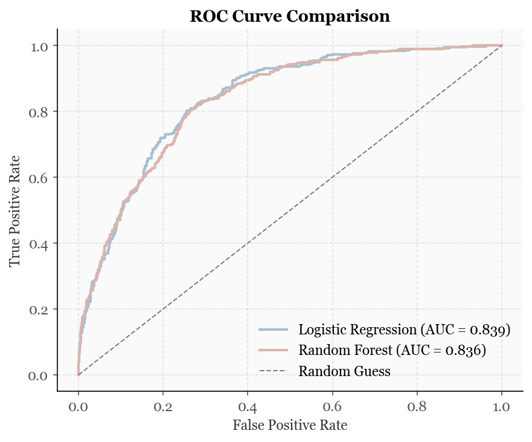
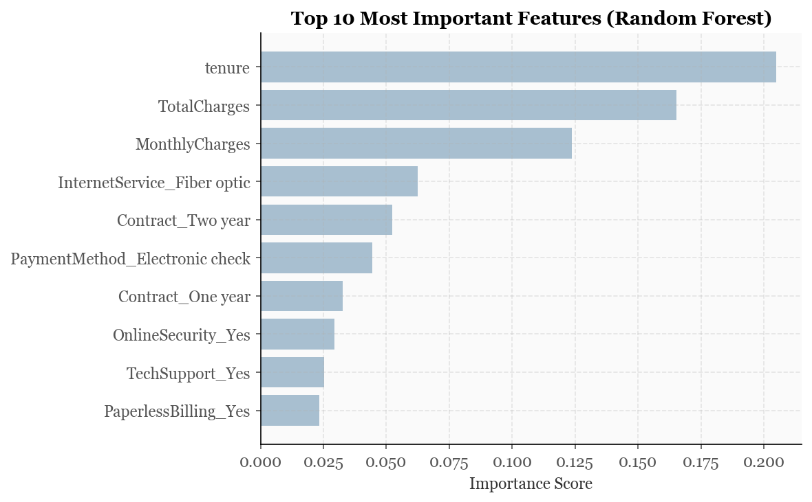

# customer-churn-prediction
Predicting customer churn using Logistic Regression and Random Forest with sklearn

## Project Overview

Customer churn — when a user stops using a service — is one of the most
costly problems in subscription-based businesses. This project builds and
evaluates predictive models to identify at-risk customers before they leave,
using real-world telecom data.

**Key Questions Answered:**
- Which customers are most likely to churn?
- What factors drive churn the most?
- Which model performs better: Logistic Regression or Random Forest?

## Dataset

**Source:** [Telco Customer Churn – Kaggle](https://www.kaggle.com/datasets/blastchar/telco-customer-churn)

7,043 customers × 21 features, including contract type, monthly charges,
tenure, and customer service interactions. Target variable: `Churn` (Yes/No).

## Methods

- Exploratory Data Analysis (EDA)
- Data cleaning and feature engineering
- Label encoding and one-hot encoding for categorical variables
- Logistic Regression (baseline model)
- Random Forest Classifier (ensemble model)
- Model evaluation: Accuracy, Precision, Recall, F1, ROC-AUC
- Feature importance analysis

## Tools & Libraries

- Python 3.x
- pandas, numpy
- scikit-learn
- matplotlib, seaborn
- Jupyter Notebook

## Project Structure

customer-churn-prediction/
│
├── data/                    # Raw dataset (not tracked by git)
├── notebooks/
│   └── churn_prediction.ipynb   # Main analysis notebook
├── README.md
├── requirements.txt
└── .gitignore

## Results

## Results

### Model Performance

| Metric | Logistic Regression | Random Forest |
|--------|---------------------|----------------|
| Accuracy | 0.7913 | 0.7906 |
| Precision | 0.6274 | 0.6386 |
| Recall | 0.5267 | 0.4866 |
| F1 Score | 0.5727 | 0.5524 |
| ROC-AUC | 0.8394 | 0.8357 |

### Key Findings

1. **Model selection**: Logistic Regression outperformed Random Forest on Recall and ROC-AUC, the two metrics most relevant to churn prediction. Simpler models can outperform more complex ones depending on the business objective.
2. **Class imbalance matters**: With only 26.5% churn rate, Accuracy alone is misleading. Recall and ROC-AUC were prioritized to ensure the model actually identifies at-risk customers.
3. **Top churn drivers**: Tenure, TotalCharges, and MonthlyCharges are the strongest predictors, followed by Fiber optic internet service and contract length.

### Visualizations

## Background & Motivation

Having executed retention-focused marketing campaigns professionally,
I built this project to understand the statistical and algorithmic foundations
of churn prediction — moving from campaign execution to building models that
identify at-risk customers before intervention is needed.

## Author

**Jinhui (Amy) Tang**
NYU Steinhardt, BS Media, Communication & Culture | Minor: Computer Science
